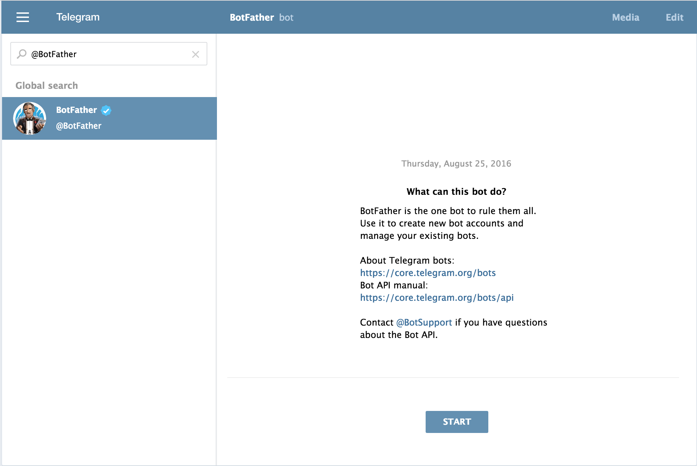
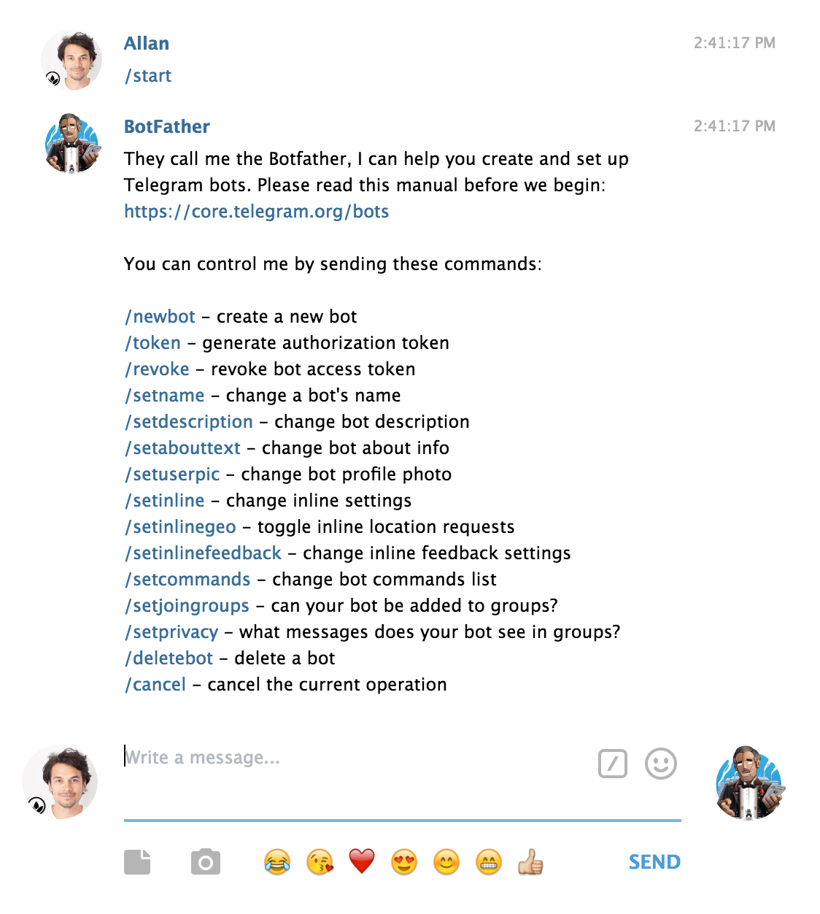
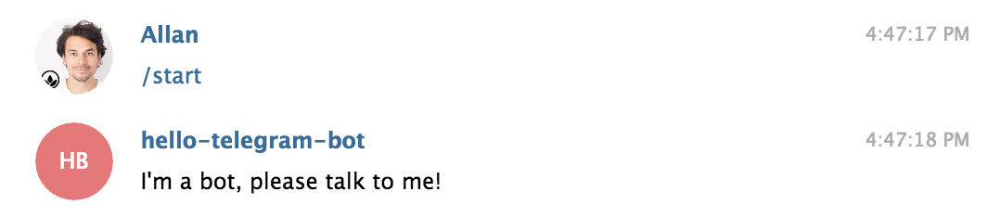
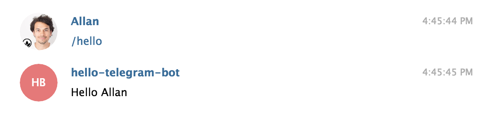
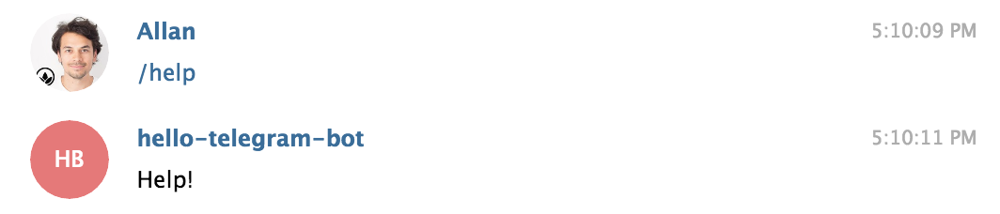
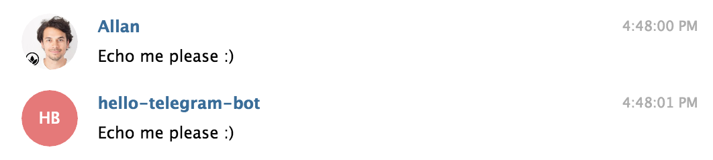

# Creating a Telegram Bot

Let's get started!

In this tutorial you'll get a Telegram Bot up and running on your local environment. Later you'll also learn how to deploy the bot to your OpenShift server.

We'll use the Python library provided by Telegram called [python-telegram-bot](https://github.com/python-telegram-bot/).

### Generate an Access Token

To begin, you'll need a Telegram Access Token for your bot.

1. Create or sign in to your [Telegram Account (Web Client)](https://web.telegram.org/)

2. Search for [`@BotFather`](https://web.telegram.org/#/im?p=@BotFather)

	

3. Initialize a conversation with the `@BotFather` by pressing the `START` button

	

4. Create a new bot by typing `/newbot` and follow the guided process.

	Congratulations, you've created your Telegram Bot 🎈🙂

5. Next, generate an access token which you'll need to communicate with your bot by typing `/token` and copy it.

### Setting up the code

6. Replace your `YOUR TOKEN` in the file `hellobot.py` in the `telegram` directory by the access token you just generated.

7. Fire up a command line and install the `python-telegram-bot` library through your command line by running:

	`pip install python-telegram-bot`

9. To start your bot run `python telegram/hellobot.py` in your command line (stop your bot by running CTRL+Z).

Go and give it a try! Start chatting with your bot and trigger the `/start` command. 🎉

If all went right your bot replies and supports the following inputs:

* /start

* /hello

* /help

* /caps your text

* Echoes messages

### Deploy your bot to OpenShift

Coming soon …

## Notes

In Telegram, add [`@Hello_Telegram_Bot`](https://web.telegram.org/#/im?p=@Hello_Telegram_Bot) and send a message to test the features in this tutorial.

Find more infos and documentation about `python-telegram-bot` at [https://github.com/python-telegram-bot/](https://github.com/python-telegram-bot/)

To send 🔊 audio, 🖼 photos, etc check out the [Telegram Bot API](https://core.telegram.org/bots/api) 🙂

### Examples by `python-telegram-bot`

Get inspired by more [Examples](https://github.com/python-telegram-bot/python-telegram-bot/tree/master/examples) here:

**[`echobot2.py`](https://github.com/python-telegram-bot/python-telegram-bot/blob/master/examples/echobot2.py)**

This is probably the base for most of the bots made with `python-telegram-bot`. It simply replies to each text message with a message that contains the same text.

**[`timerbot.py`](https://github.com/python-telegram-bot/python-telegram-bot/blob/master/examples/timerbot.py)**

This bot uses the [`JobQueue`](https://pythonhosted.org/python-telegram-bot/telegram.ext.jobqueue.html) class to send timed messages. The user sets a timer by using `/set` command with a specific time, for example `/set 30`. The bot then sets up a job to send a message to that user after 30 seconds. The user can also cancel the timer by sending `/unset`. To learn more about the `JobQueue`, read [this wiki article](https://github.com/python-telegram-bot/python-telegram-bot/wiki/Extensions-%E2%80%93-JobQueue).

**[`conversationbot.py`](https://github.com/python-telegram-bot/python-telegram-bot/blob/master/examples/conversationbot.py)**

A common task for a bot is to ask information from the user. In v5.0 of this library, we introduced the [`ConversationHandler`](https://pythonhosted.org/python-telegram-bot/telegram.ext.conversationhandler.html) for that exact purpose. This example uses it to retrieve user-information in a conversation-like style.

**[`inlinekeyboard.py`](https://github.com/python-telegram-bot/python-telegram-bot/blob/master/examples/inlinekeyboard.py)**

This example sheds some light on inline keyboards, callback queries and message editing.

**[`inlinebot.py`](https://github.com/python-telegram-bot/python-telegram-bot/blob/master/examples/inlinebot.py)**

A basic example of an [inline bot](https://core.telegram.org/bots/inline). Don't forget to enable inline mode with [@BotFather](https://telegram.me/BotFather).
